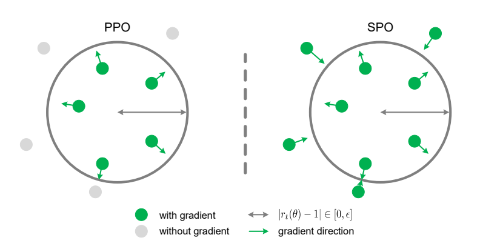
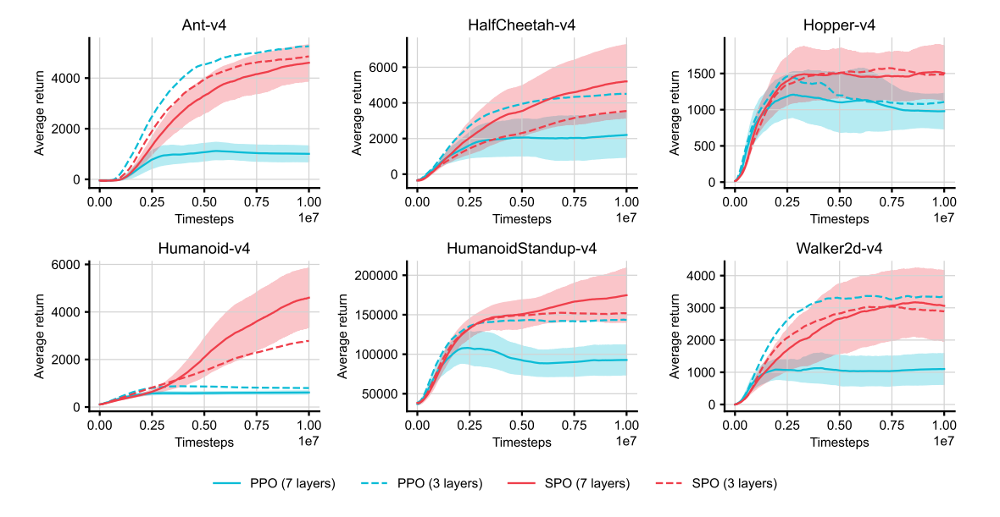

<h1 align="center">
	Simple Policy Optimization<br>
</h1>

<p align="center">
  Zhengpeng Xie*, Qiang Zhang*, Fan Yang*, Marco Hutter, Renjing Xu
</p>

<p align="center">
  HKUST(GZ), ETH Zurich
</p>

<p align="center">
	
  [zhengpengxie@hkust-gz.edu.cn](mailto:example@example.com), [qzhang749@connect.hkust-gz.edu.cn](mailto:example@example.com), [fanyang1@ethz.ch](mailto:example@example.com), [mahutter@ethz.ch](mailto:example@example.com), [renjingxu@hkust-gz.edu.cn](mailto:example@example.com)
</p>

Accepted to <i style="color: black; display: inline;"><b>International Conference on Machine Learning (ICML 2025)</b></i> | [arXiv](https://arxiv.org/abs/2401.16025)<br>

<div align="center">
  
</div>

**Caption:** By slightly modifying the policy loss in PPO, SPO enforces trust region constraints without relying on the expensive second-order optimization used in TRPO, leading to stable performance improvements.

<div align="center">
  
</div>

**Caption:** SPO simplifies the training of deep policy networks, addressing a key challenge faced by existing algorithms.

# Installation
To ensure the reproducibility of our main results, please follow the steps below to install the dependencies.

## MuJoCo
Create Anaconda environment:
```bash
conda create -n mujoco_py311 python=3.11 --yes
conda activate mujoco_py311
```

Install the mujoco requirements:
```bash
cd mujoco
pip install -r requirements.txt
```

Choose the CUDA version on the official PyTorch website: https://pytorch.org/
```bash
pip3 install torch torchvision torchaudio --index-url https://download.pytorch.org/whl/cu121
```

Install the remaining requirements:
```bash
pip install gymnasium[mujoco]
```

Start training:
```bash
python main.py
```

## Atari
Create Anaconda environment:
```bash
conda create -n atari_py311 python=3.11 --yes
conda activate atari_py311
```

Install the atari requirements:
```bash
cd atari
pip install -r requirements.txt
```

Choose the CUDA version on the official PyTorch website: [https://pytorch.org/](https://pytorch.org/)
```bash
pip3 install torch torchvision torchaudio --index-url https://download.pytorch.org/whl/cu121
```

Install the remaining requirements:
```bash
pip install gymnasium[atari]
pip install gymnasium[accept-rom-license]
pip install gymnasium[other]
```

Start training:
```bash
python main.py
```

# Acknowledgement
Our code is mainly based on [cleanrl](https://github.com/vwxyzjn/cleanrl), many thanks to their efforts for the community.
